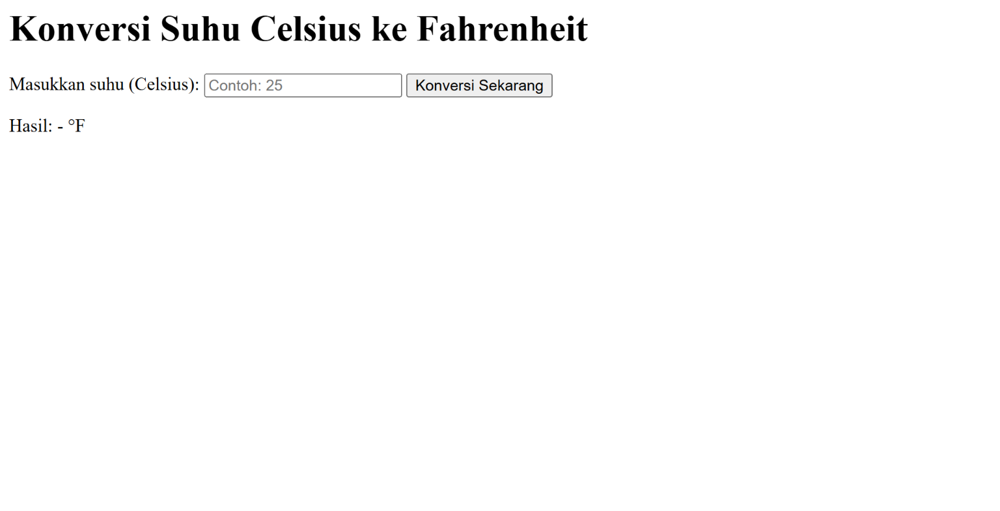
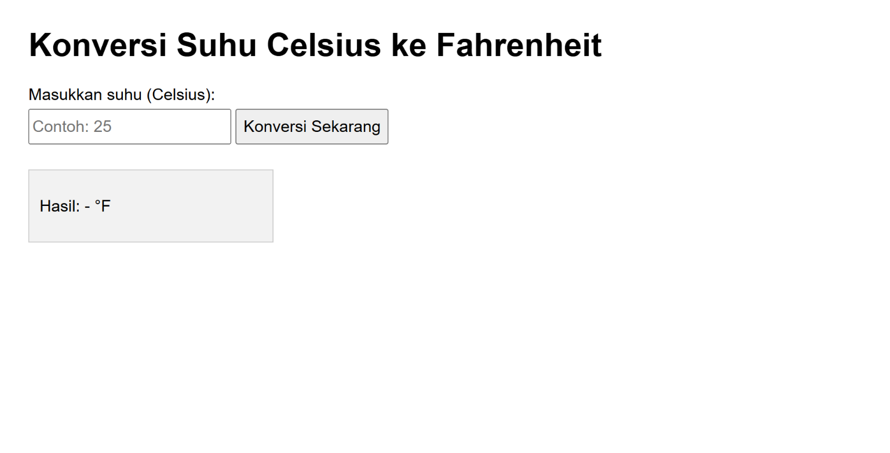
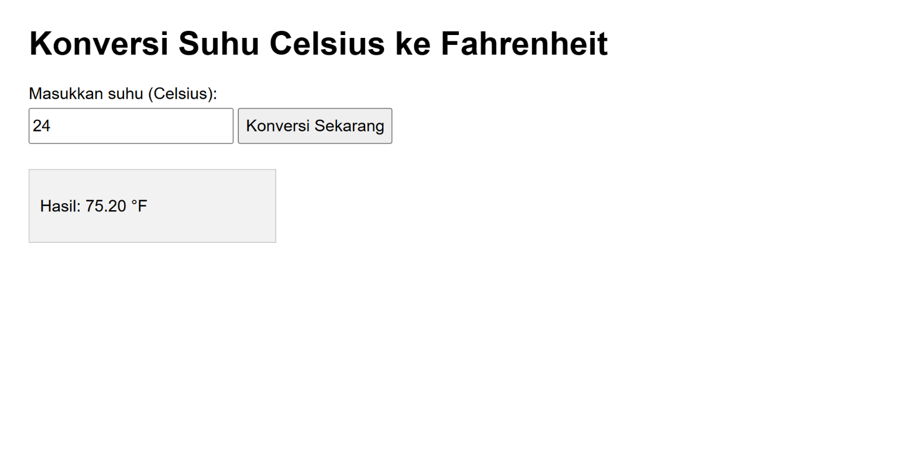
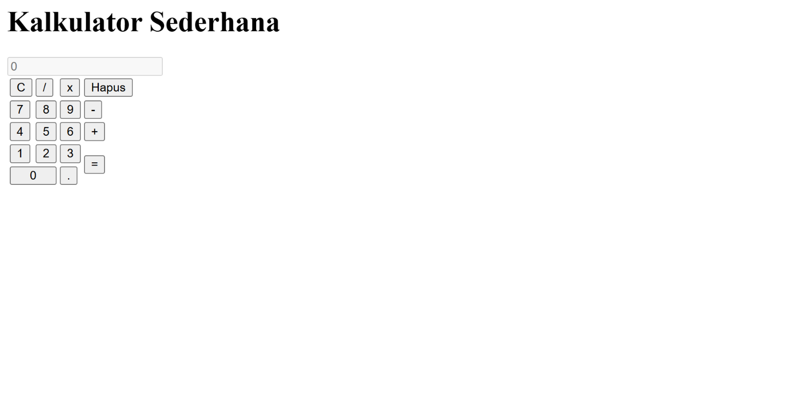
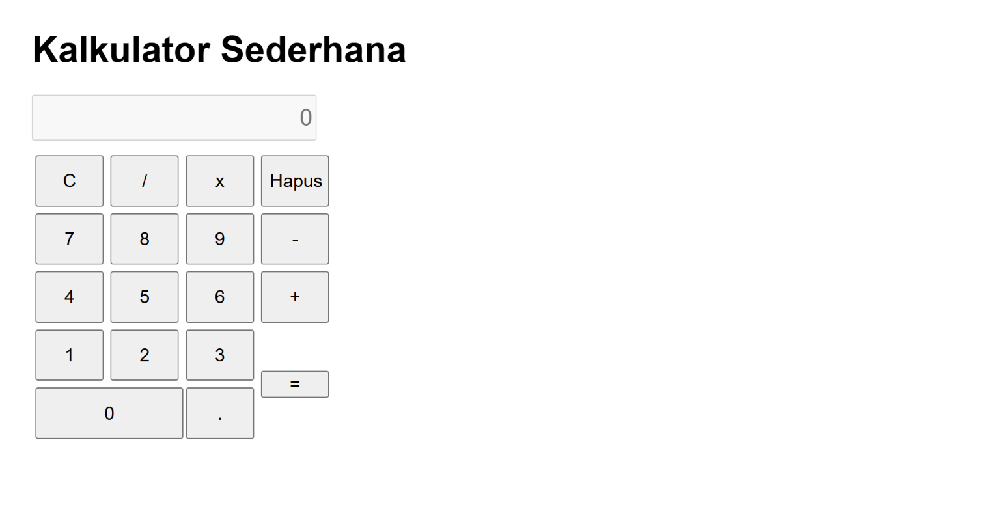
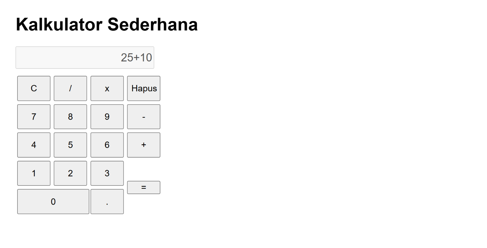

# Tutorial: Membuat Konversi Suhu & Kalkulator Sederhana

### Modul — HTML, CSS, JavaScript

Di tutorial ini, kita akan membuat **2 file HTML terpisah**:

1. `konversisuhu.html` — konversi suhu dari **Celsius ke Fahrenheit**
2. `kalkulator.html` — kalkulator sederhana (tambah, kurang, kali, bagi)

Setiap file berdiri sendiri, jadi tidak perlu file CSS atau JS terpisah. Semua kode (HTML, CSS, JS) ditulis dalam satu file yang sama.

---

## Daftar Isi

1. [Persiapan](#1-persiapan)
2. [File 1 — konversisuhu.html](#2-file-1--konversisuhuhtml)
3. [File 2 — kalkulator.html](#3-file-2--kalkulatorhtml)
4. [Cara Menjalankan](#4-cara-menjalankan)

---

## 1. Persiapan

Yang kamu butuhkan:

- **Text editor**, misalnya Notepad, VS Code, atau Sublime Text.
- **Browser**, misalnya Chrome atau Firefox, untuk membuka hasilnya.

Buat 1 folder baru, misalnya folder bernama `belajar-html`. Nanti kedua file akan disimpan di folder yang sama:

```
belajar-html/
├── konversisuhu.html
└── kalkulator.html
```

---

## 2. File 1 — konversisuhu.html

Buat file baru bernama `konversisuhu.html` di folder yang sama. Program ini hanya menerima **input suhu Celsius**, lalu menampilkan hasil konversinya ke **Fahrenheit**.

### Langkah 1: Kerangka HTML

Semua file HTML dimulai dengan kerangka dasar ini:

```html
<html>
   <head>
      <title>Konversi Suhu Celsius ke Fahrenheit</title>
      <style></style>
   </head>
   <body></body>
</html>
```

Sama seperti tadi, halaman ini masih **kosong** kalau dibuka sekarang. Lanjut isi `<body>`-nya.

### Langkah 2: Tambahkan Form Input

Di dalam `<body>`, tambahkan judul, kotak input, dan tombol:

```html
<h1>Konversi Suhu Celsius ke Fahrenheit</h1>

<label for="inputCelsius">Masukkan suhu (Celsius):</label>
<input type="number" id="inputCelsius" placeholder="Contoh: 25" />

<button onclick="konversiSuhu()">Konversi Sekarang</button>

<div id="hasilSuhu">
   <p>Hasil: <span id="hasilFahrenheit">-</span> °F</p>
</div>
```

**Penjelasan:**

- `<input type="number">` khusus untuk mengetik angka. Ini satu-satunya input yang dibutuhkan, karena kita hanya menerima suhu dalam Celsius.
- Tombol memanggil fungsi `konversiSuhu()` saat diklik.
- `<span id="hasilFahrenheit">` adalah tempat hasil konversi ditampilkan.

**Hasil ketika dijalankan:**



Label, kotak input, dan tombol sudah muncul di halaman, tapi tampilannya masih polos (langsung mengikuti gaya bawaan browser). Kalau tombol diklik pun belum terjadi apa-apa, karena fungsi `konversiSuhu()` belum kita tulis.

### Langkah 3: Tambahkan CSS Sederhana

Isi bagian `<style>`:

```css
body {
   font-family: Arial, sans-serif;
   padding: 20px;
}

label {
   display: block;
   margin-bottom: 5px;
}

input[type="number"] {
   width: 200px;
   height: 35px;
   font-size: 16px;
   margin-bottom: 10px;
}

button {
   height: 35px;
   font-size: 16px;
   cursor: pointer;
}

#hasilSuhu {
   margin-top: 15px;
   padding: 10px;
   background-color: #f2f2f2;
   border: 1px solid #cccccc;
   width: 220px;
}
```

**Hasil ketika dijalankan:**



Kotak input jadi lebih besar dan mudah dibaca, dan area hasil di bawah tombol sekarang punya latar abu-abu dan garis tepi supaya terlihat jelas terpisah dari form. Tombolnya masih belum bisa dipakai untuk menghitung apapun — itu akan diselesaikan di langkah terakhir.

### Langkah 4: Tambahkan JavaScript

Tambahkan `<script>` sebelum `</body>`:

```html
<script>
   function konversiSuhu() {
      const celsius = parseFloat(document.getElementById("inputCelsius").value);

      if (isNaN(celsius)) {
         alert("Masukkan angka suhu yang benar dulu, ya!");
         return;
      }

      // Rumus: Fahrenheit = (Celsius x 9/5) + 32
      const fahrenheit = (celsius * 9) / 5 + 32;

      document.getElementById("hasilFahrenheit").textContent =
         fahrenheit.toFixed(2);
   }
</script>
```

**Penjelasan:**

| Bagian                         | Kegunaan                                           |
| --------------------------------| ----------------------------------------------------|
| `parseFloat(...)`              | Mengubah teks yang diketik menjadi angka desimal   |
| `isNaN(celsius)`               | Mengecek apakah yang dimasukkan benar-benar angka  |
| Rumus `(celsius * 9 / 5) + 32` | Rumus konversi dari Celsius ke Fahrenheit          |
| `toFixed(2)`                   | Membulatkan hasil menjadi 2 angka di belakang koma |

**Hasil ketika dijalankan:**



Sekarang program sudah bisa menghitung. Coba ketik angka di kotak input, misalnya `25`, lalu klik tombol **Konversi Sekarang**. Bagian "Hasil" akan berubah menampilkan angka `77.00 °F` — sesuai rumus Celsius ke Fahrenheit. Kalau kotak input dibiarkan kosong lalu tombol diklik, akan muncul kotak peringatan (`alert`) yang meminta pengguna mengisi angka yang benar terlebih dahulu.

### Kode Lengkap konversisuhu.html

```html
<html>
   <head>
      <title>Konversi Suhu Celsius ke Fahrenheit</title>
      <style>
         body {
            font-family: Arial, sans-serif;
            padding: 20px;
         }

         label {
            display: block;
            margin-bottom: 5px;
         }

         input[type="number"] {
            width: 200px;
            height: 35px;
            font-size: 16px;
            margin-bottom: 10px;
         }

         button {
            height: 35px;
            font-size: 16px;
            cursor: pointer;
         }

         #hasilSuhu {
            margin-top: 15px;
            padding: 10px;
            background-color: #f2f2f2;
            border: 1px solid #cccccc;
            width: 220px;
         }
      </style>
   </head>
   <body>
      <h1>Konversi Suhu Celsius ke Fahrenheit</h1>

      <label for="inputCelsius">Masukkan suhu (Celsius):</label>
      <input type="number" id="inputCelsius" placeholder="Contoh: 25" />

      <button onclick="konversiSuhu()">Konversi Sekarang</button>

      <div id="hasilSuhu">
         <p>Hasil: <span id="hasilFahrenheit">-</span> °F</p>
      </div>

      <script>
         function konversiSuhu() {
            const celsius = parseFloat(
               document.getElementById("inputCelsius").value,
            );

            if (isNaN(celsius)) {
               alert("Masukkan angka suhu yang benar dulu, ya!");
               return;
            }

            // Rumus: Fahrenheit = (Celsius x 9/5) + 32
            const fahrenheit = (celsius * 9) / 5 + 32;

            document.getElementById("hasilFahrenheit").textContent =
               fahrenheit.toFixed(2);
         }
      </script>
   </body>
</html>
```

---

## 3. File 2 — kalkulator.html

Buat file baru bernama `kalkulator.html`, lalu ketik (atau salin) kode berikut.

### Langkah 1: Kerangka HTML

Semua file HTML dimulai dengan kerangka dasar ini:

```html
<html>
   <head>
      <title>Kalkulator Sederhana</title>
      <style></style>
   </head>
   <body></body>
</html>
```

> `<style>` di dalam `<head>` adalah tempat kita menulis CSS (pengaturan tampilan). `<body>` adalah tempat konten yang terlihat di halaman.

Kalau file ini dibuka di browser sekarang, halamannya masih **kosong putih polos** — karena `<body>` belum diisi apa-apa. Itu wajar, lanjut ke langkah berikutnya.

### Langkah 2: Tambahkan Layar dan Tombol

Di dalam `<body>`, tambahkan judul, layar (tempat menampilkan angka), dan tombol-tombol angka:

```html
<h1>Kalkulator Sederhana</h1>

<input type="text" id="layar" disabled placeholder="0" />

<table>
   <tr>
      <td><button onclick="hapusSemua()">C</button></td>
      <td><button onclick="tambahKarakter('/')">/ </button></td>
      <td><button onclick="tambahKarakter('*')">x</button></td>
      <td><button onclick="hapusSatu()">Hapus</button></td>
   </tr>
   <tr>
      <td><button onclick="tambahKarakter('7')">7</button></td>
      <td><button onclick="tambahKarakter('8')">8</button></td>
      <td><button onclick="tambahKarakter('9')">9</button></td>
      <td><button onclick="tambahKarakter('-')">-</button></td>
   </tr>
   <tr>
      <td><button onclick="tambahKarakter('4')">4</button></td>
      <td><button onclick="tambahKarakter('5')">5</button></td>
      <td><button onclick="tambahKarakter('6')">6</button></td>
      <td><button onclick="tambahKarakter('+')">+</button></td>
   </tr>
   <tr>
      <td><button onclick="tambahKarakter('1')">1</button></td>
      <td><button onclick="tambahKarakter('2')">2</button></td>
      <td><button onclick="tambahKarakter('3')">3</button></td>
      <td rowspan="2">
         <button onclick="hitungHasil()" style="height:100%;">=</button>
      </td>
   </tr>
   <tr>
      <td colspan="2">
         <button onclick="tambahKarakter('0')" style="width:100%;">0</button>
      </td>
      <td><button onclick="tambahKarakter('.')">.</button></td>
   </tr>
</table>
```

**Penjelasan:**

- `<input id="layar">` adalah kotak yang menampilkan angka. `disabled` artinya siswa tidak bisa mengetik langsung di situ, harus lewat tombol.
- Setiap `<button>` punya `onclick`, yaitu perintah yang dijalankan saat tombol diklik. Kita akan buat fungsi-fungsi ini di Langkah 4.
- `<table>` dipakai supaya tombol-tombol tersusun rapi dalam bentuk baris dan kolom, seperti kalkulator biasa.

**Hasil ketika dijalankan:**



Di tahap ini, layar dan semua tombol angka **sudah muncul**, tapi tampilannya masih polos dan tombolnya menumpuk tidak beraturan, karena kita belum menambahkan CSS sama sekali. Fungsi tombol-tombolnya juga belum bekerja kalau diklik, karena JavaScript-nya juga belum ada. Ini normal — lanjut ke Langkah 3.

### Langkah 3: Tambahkan CSS Sederhana

Sekarang isi bagian `<style>` yang tadi masih kosong, supaya tampilannya lebih rapi:

```css
body {
   font-family: Arial, sans-serif;
   padding: 20px;
}

#layar {
   width: 250px;
   height: 40px;
   font-size: 20px;
   text-align: right;
   margin-bottom: 10px;
}

table {
   border-collapse: collapse;
}

table button {
   width: 60px;
   height: 45px;
   font-size: 16px;
   margin: 2px;
   cursor: pointer;
}
```

**Penjelasan:**

- `font-family` mengganti jenis huruf di seluruh halaman.
- `#layar` mengatur ukuran dan tampilan kotak layar.
- `table button` mengatur ukuran semua tombol supaya seragam.

**Hasil ketika dijalankan:**



Sekarang tampilannya sudah jauh lebih rapi — layar punya ukuran dan garis tepi yang jelas, dan semua tombol tersusun seragam membentuk grid 4 kolom seperti kalkulator sungguhan. Tapi kalau dicoba diklik, tombolnya **masih belum berfungsi**, karena logikanya (JavaScript) belum ditulis.

### Langkah 4: Tambahkan JavaScript

Terakhir, tambahkan `<script>` sebelum tag penutup `</body>`:

```html
<script>
   let layar = document.getElementById("layar");

   function tambahKarakter(nilai) {
      layar.value += nilai;
   }

   function hapusSemua() {
      layar.value = "";
   }

   function hapusSatu() {
      layar.value = layar.value.slice(0, -1);
   }

   function hitungHasil() {
      try {
         if (/[^0-9+\-*/.]/.test(layar.value)) {
            layar.value = "Error";
            return;
         }
         layar.value = eval(layar.value);
      } catch (kesalahan) {
         layar.value = "Error";
      }
   }
</script>
```

**Penjelasan tiap fungsi:**

| Fungsi                  | Kegunaan                                        |
| ----------------------- | ----------------------------------------------- |
| `tambahKarakter(nilai)` | Menambahkan angka atau simbol operator ke layar |
| `hapusSemua()`          | Mengosongkan layar (tombol C)                   |
| `hapusSatu()`           | Menghapus 1 karakter terakhir (tombol Hapus)    |
| `hitungHasil()`         | Menghitung hasil dari angka yang ada di layar   |

**Hasil ketika dijalankan:**



Ini tahap terakhir — kalkulator **sudah berfungsi sepenuhnya**. Coba klik beberapa angka dan operator, misalnya `12 + 8`, lalu tekan tombol `=`. Layar akan menampilkan hasilnya, yaitu `20`. Tombol `C` akan mengosongkan layar, dan tombol `Hapus` akan menghapus satu karakter terakhir saja — cocok kalau salah ketik.

### Kode Lengkap kalkulator.html

Setelah semua langkah digabung, file `kalkulator.html` akan terlihat seperti ini:

```html
<html>
   <head>
      <title>Kalkulator Sederhana</title>
      <style>
         body {
            font-family: Arial, sans-serif;
            padding: 20px;
         }

         #layar {
            width: 250px;
            height: 40px;
            font-size: 20px;
            text-align: right;
            margin-bottom: 10px;
         }

         table {
            border-collapse: collapse;
         }

         table button {
            width: 60px;
            height: 45px;
            font-size: 16px;
            margin: 2px;
            cursor: pointer;
         }
      </style>
   </head>
   <body>
      <h1>Kalkulator Sederhana</h1>

      <input type="text" id="layar" disabled placeholder="0" />

      <table>
         <tr>
            <td><button onclick="hapusSemua()">C</button></td>
            <td><button onclick="tambahKarakter('/')">/ </button></td>
            <td><button onclick="tambahKarakter('*')">x</button></td>
            <td><button onclick="hapusSatu()">Hapus</button></td>
         </tr>
         <tr>
            <td><button onclick="tambahKarakter('7')">7</button></td>
            <td><button onclick="tambahKarakter('8')">8</button></td>
            <td><button onclick="tambahKarakter('9')">9</button></td>
            <td><button onclick="tambahKarakter('-')">-</button></td>
         </tr>
         <tr>
            <td><button onclick="tambahKarakter('4')">4</button></td>
            <td><button onclick="tambahKarakter('5')">5</button></td>
            <td><button onclick="tambahKarakter('6')">6</button></td>
            <td><button onclick="tambahKarakter('+')">+</button></td>
         </tr>
         <tr>
            <td><button onclick="tambahKarakter('1')">1</button></td>
            <td><button onclick="tambahKarakter('2')">2</button></td>
            <td><button onclick="tambahKarakter('3')">3</button></td>
            <td rowspan="2">
               <button onclick="hitungHasil()" style="height:100%;">=</button>
            </td>
         </tr>
         <tr>
            <td colspan="2">
               <button onclick="tambahKarakter('0')" style="width:100%;">
                  0
               </button>
            </td>
            <td><button onclick="tambahKarakter('.')">.</button></td>
         </tr>
      </table>

      <script>
         let layar = document.getElementById("layar");

         function tambahKarakter(nilai) {
            layar.value += nilai;
         }

         function hapusSemua() {
            layar.value = "";
         }

         function hapusSatu() {
            layar.value = layar.value.slice(0, -1);
         }

         function hitungHasil() {
            try {
               if (/[^0-9+\-*/.]/.test(layar.value)) {
                  layar.value = "Error";
                  return;
               }
               layar.value = eval(layar.value);
            } catch (kesalahan) {
               layar.value = "Error";
            }
         }
      </script>
   </body>
</html>
```

---

## 4. Cara Menjalankan

1. Pastikan `konversisuhu.html` dan `kalkulator.html` sudah tersimpan di folder yang sama.
2. Klik kanan pada salah satu file, pilih **Open with** → pilih browser (Chrome/Firefox).
3. Halaman akan terbuka dan program siap dipakai.
4. Ulangi untuk file yang satunya.

> 💡 Tidak perlu aplikasi tambahan atau internet — file HTML bisa langsung dibuka dari komputer.
