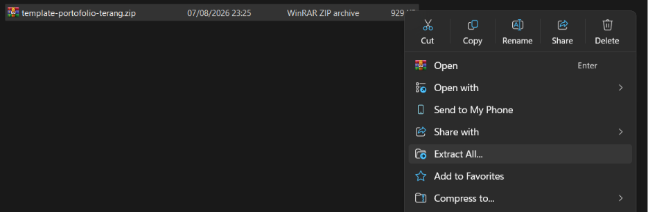
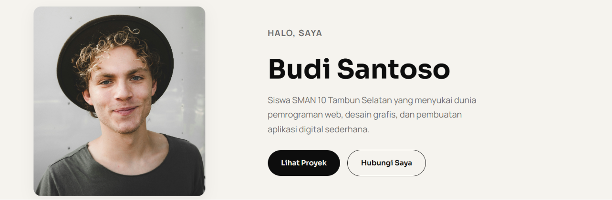
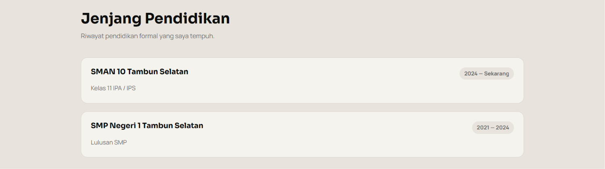
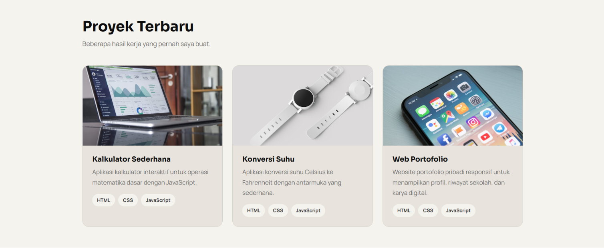
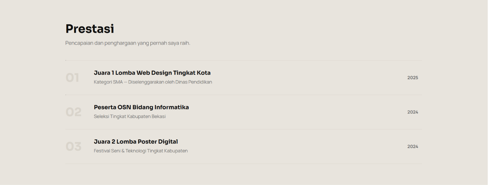
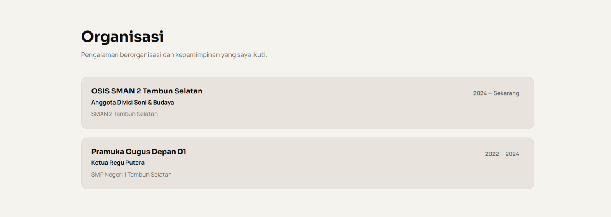
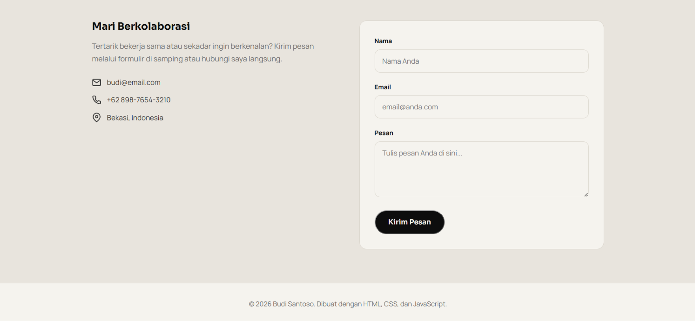
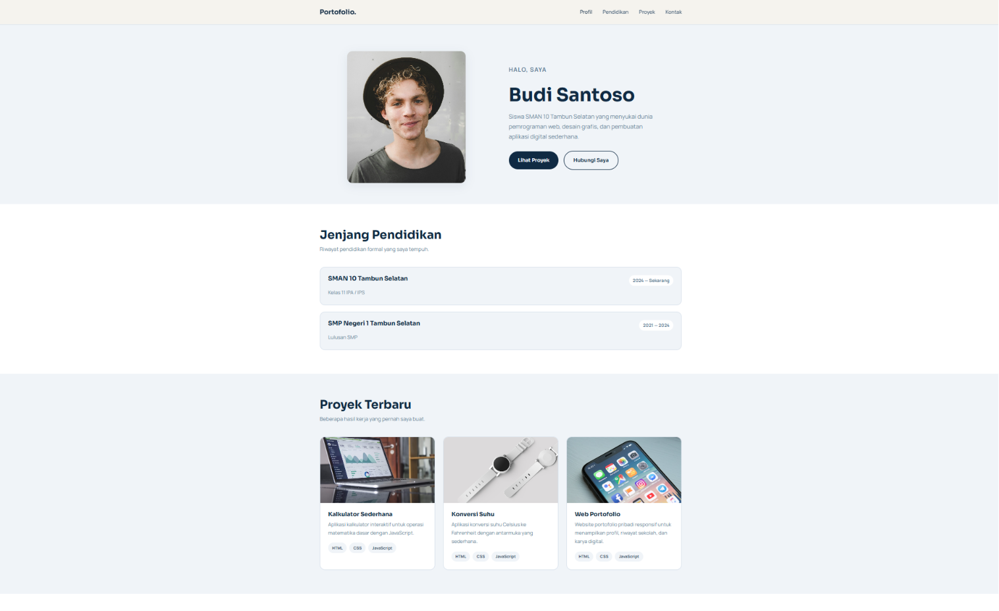

# Tutorial: Mengedit & Kustomisasi Template Portofolio Putih

### Modul — HTML, CSS, JavaScript

Di tutorial ini, kamu akan mengedit dan mengkustomisasi template website portofolio siap pakai yang ada di folder **`portofolio-putih/`**. Kamu akan mengubah nama, deskripsi, foto profil, riwayat pendidikan, daftar proyek beserta gambarnya, daftar prestasi, pengalaman organisasi, informasi kontak, hingga warna tampilan website sesuai identitas kamu sendiri.

---

## Daftar Isi

1. [Persiapan & Struktur File](#1-persiapan--struktur-file)
2. [Panduan Kustomisasi `portofolio-putih/index.html`](#2-panduan-kustomisasi-portofolio-putihindexhtml)
   - [Langkah 1: Mengubah Judul Tab Browser & Meta](#langkah-1-mengubah-judul-tab-browser--meta)
   - [Langkah 2: Mengubah Nama & Deskripsi Hero/Profil](#langkah-2-mengubah-nama--deskripsi-heroprofil)
   - [Langkah 3: Mengubah Foto Profil](#langkah-3-mengubah-foto-profil)
   - [Langkah 4: Mengubah Riwayat Pendidikan](#langkah-4-mengubah-riwayat-pendidikan)
   - [Langkah 5: Mengubah & Menambah Daftar Proyek](#langkah-5-mengubah--menambah-daftar-proyek)
   - [Langkah 6: Mengubah Gambar Proyek](#langkah-6-mengubah-gambar-proyek)
   - [Langkah 7: Mengubah Daftar Prestasi](#langkah-7-mengubah-daftar-prestasi)
   - [Langkah 8: Mengubah Daftar Organisasi](#langkah-8-mengubah-daftar-organisasi)
   - [Langkah 9: Mengubah Informasi Kontak & Footer](#langkah-9-mengubah-informasi-kontak--footer)
   - [Langkah 10: Mengkustomisasi Tema Warna (CSS Variable)](#langkah-10-mengkustomisasi-tema-warna-css-variable)
3. [Cara Menjalankan & Memeriksa Hasil](#3-cara-menjalankan--memeriksa-hasil)

---

## 1. Persiapan & Struktur File

### Download Template

1. Buka website galeri template di: **https://template-portofolio-pkm.vercel.app/**
2. Pilih **Template Terang** (putih), lalu klik tombol download.
3. File yang akan terunduh bernama **`template-portofolio-terang.zip`**.

### Extract File ZIP

1. Temukan file `template-portofolio-terang.zip` di folder **Downloads**.
2. Klik kanan file tersebut, lalu pilih **Extract All...** (Windows) atau **Extract Here**.
3. Tentukan lokasi tujuan extract, misalnya di folder `Dokumen` atau `Desktop`.
4. Klik **Extract**. Setelah selesai, akan muncul folder bernama **`portofolio-putih/`**.



### Struktur Folder Hasil Extract

```
portofolio-putih/
  ├── index.html        <-- File HTML utama yang akan kita edit
  └── img/
      ├── profile.jpg   <-- Foto profil placeholder
      ├── proyek1.jpeg  <-- Gambar proyek 1 placeholder
      ├── proyek2.jpeg  <-- Gambar proyek 2 placeholder
      └── proyek3.jpeg  <-- Gambar proyek 3 placeholder
```

> **Persiapan sebelum mulai mengedit:**
> 1. Siapkan **foto profil kamu** (format `.jpg` atau `.png`).
> 2. Siapkan **gambar untuk setiap proyek** kamu (format `.jpg`, `.jpeg`, atau `.png`).
> 3. Simpan semua gambar tersebut ke dalam folder `portofolio-putih/img/`.

---

## 2. Panduan Kustomisasi `portofolio-putih/index.html`

Buka file **`portofolio-putih/index.html`** di Text Editor (misalnya VS Code), lalu ikuti petunjuk langkah demi langkah di bawah ini:

---

### Langkah 1: Mengubah Judul Tab Browser & Meta

#### Letak Kode (Baris 6 & 11):
```html
<title>Portofolio — Nama Anda</title>
...
<meta property="og:title" content="Portofolio — Nama Anda" />
```

#### Perubahan (Ganti dengan nama kamu):
```html
<title>Portofolio — Budi Santoso</title>
...
<meta property="og:title" content="Portofolio — Budi Santoso" />
```

#### Hasil:


---

### Langkah 2: Mengubah Nama & Deskripsi Hero/Profil

#### Letak Kode (Baris 674 - 680):
Cari tag `<section id="profil" class="hero">`:

```html
<p class="greeting">Halo, saya</p>
<h1>Nama Anda</h1>
<p>
   Seorang pengembang, desainer, atau profesional kreatif
   yang suka membangun produk digital yang bermanfaat dan
   menyenangkan untuk digunakan.
</p>
```

#### Perubahan (Sesuaikan dengan identitasmu):
```html
<p class="greeting">Halo, saya</p>
<h1>Budi Santoso</h1>
<p>
   Siswa SMAN 2 Tambun Selatan yang menyukai dunia pemrograman web, desain grafis, dan pembuatan aplikasi digital sederhana.
</p>
```


#### Hasil:

---

### Langkah 3: Mengubah Foto Profil

#### Letak Kode (Baris 690 - 697):
Cari tag `<div class="hero-image">`:

```html
<div class="hero-image">
   
</div>
```

#### Perubahan:
Ganti `img/profile.jpg` dengan nama file fotomu yang sudah disalin ke folder `portofolio-putih/img/`:

```html
<div class="hero-image">
   
</div>
```

---

### Langkah 4: Mengubah Riwayat Pendidikan

#### Letak Kode (Baris 709 - 731):
Cari bagian `<section id="pendidikan" class="section education">`. Di dalamnya terdapat beberapa elemen `<article class="timeline-item">`:

```html
<article class="timeline-item">
   <div class="timeline-header">
      <h3>Sarjana Teknik Informatika</h3>
      <span class="year">2018 — 2022</span>
   </div>
   <p class="institution">Universitas Contoh Indonesia</p>
</article>
```

#### Perubahan (Sesuaikan dengan riwayat sekolahmu):
```html
<article class="timeline-item">
   <div class="timeline-header">
      <h3>SMAN 2 Tambun Selatan</h3>
      <span class="year">2024 — Sekarang</span>
   </div>
   <p class="institution">Kelas 11 IPA / IPS</p>
</article>
<article class="timeline-item">
   <div class="timeline-header">
      <h3>SMP Negeri 1 Tambun Selatan</h3>
      <span class="year">2021 — 2024</span>
   </div>
   <p class="institution">Lulusan SMP</p>
</article>
```

#### Hasil:


---

### Langkah 5: Mengubah & Menambah Daftar Proyek

#### Letak Kode (Baris 742 - 797):
Cari bagian `<section id="proyek" class="section">`. Setiap proyek dibungkus oleh elemen `<article class="project-card">`:

```html
<article class="project-card">
   
   <div class="project-body">
      <h3>Dashboard Analitik</h3>
      <p>
         Dashboard interaktif untuk memantau metrik bisnis
         secara real-time.
      </p>
      <div class="tags">
         <span class="tag">React</span>
         <span class="tag">Tailwind</span>
         <span class="tag">Chart.js</span>
      </div>
   </div>
</article>
```

#### Perubahan (Edit teks judul, deskripsi, dan tag teknologi):
```html
<article class="project-card">
   
   <div class="project-body">
      <h3>Kalkulator Sederhana</h3>
      <p>
         Aplikasi kalkulator interaktif untuk operasi matematika dasar dengan JavaScript.
      </p>
      <div class="tags">
         <span class="tag">HTML</span>
         <span class="tag">CSS</span>
         <span class="tag">JavaScript</span>
      </div>
   </div>
</article>
```

#### Cara Menambah Proyek Baru:
Duplikat satu blok `<article class="project-card">...</article>` lalu paste tepat di bawah proyek sebelumnya (sebelum `</div>` penutup `project-grid`).

#### Hasil:


---

### Langkah 6: Mengubah Gambar Proyek

Template sudah menyediakan 3 file gambar placeholder di folder `portofolio-putih/img/`:
- `proyek1.jpeg` — dipakai oleh kartu proyek pertama
- `proyek2.jpeg` — dipakai oleh kartu proyek kedua
- `proyek3.jpeg` — dipakai oleh kartu proyek ketiga

#### Cara menggantinya:

**Metode 1 — Timpa file lama (paling mudah):**
1. Siapkan gambar proyekmu (misalnya screenshot website atau foto hasil kerja).
2. Ubah nama file gambar tersebut menjadi `proyek1.jpeg` (atau `proyek2.jpeg` / `proyek3.jpeg`).
3. Salin file tersebut ke folder `portofolio-putih/img/`, lalu pilih **Replace** / **Timpa** jika diminta konfirmasi.
4. Buka browser dan refresh halaman — gambar baru akan langsung muncul tanpa perlu mengubah kode HTML.

**Metode 2 — Simpan dengan nama baru lalu ubah kode:**
1. Salin gambar proyekmu ke folder `portofolio-putih/img/` dengan nama berbeda, misalnya `kalkulator.png`.
2. Di dalam `index.html`, cari baris berikut (Baris 744 - 746):
   ```html
   
   ```
3. Ganti nilai `src` dan `alt` sesuai nama file dan deskripsi proyekmu:
   ```html
   
   ```
4. Lakukan hal yang sama untuk proyek kedua (Baris 762 - 764) dan ketiga (Baris 780 - 782).

> **Catatan:** Pastikan nama file tidak mengandung spasi. Gunakan tanda hubung (`-`) atau garis bawah (`_`) sebagai pengganti spasi. Contoh: `proyek-kalkulator.jpg` bukan `proyek kalkulator.jpg`.

---

### Langkah 7: Mengubah Daftar Prestasi

Template putih memiliki section **Prestasi** dengan tampilan daftar berformat baris (*list row*). Setiap prestasi ditampilkan dengan nomor urut, judul, keterangan, dan tahun.

#### Letak Kode (Baris 808 - 841):
Cari bagian `<section id="prestasi" class="section prestasi">`. Setiap entri prestasi dibungkus oleh elemen `<div class="prestasi-row">`:

```html
<div class="prestasi-row">
   <span class="prestasi-watermark">01</span>
   <div class="prestasi-body">
      <h3>Juara 1 Olimpiade Sains Nasional</h3>
      <p>Bidang Informatika &mdash; Tingkat Provinsi</p>
   </div>
   <span class="year">2023</span>
</div>
```

#### Perubahan (Sesuaikan dengan prestasi kamu):
```html
<div class="prestasi-row">
   <span class="prestasi-watermark">01</span>
   <div class="prestasi-body">
      <h3>Juara 1 Lomba Web Design Tingkat Kota</h3>
      <p>Kategori SMA &mdash; Diselenggarakan oleh Dinas Pendidikan</p>
   </div>
   <span class="year">2025</span>
</div>
<div class="prestasi-row">
   <span class="prestasi-watermark">02</span>
   <div class="prestasi-body">
      <h3>Peserta OSN Bidang Informatika</h3>
      <p>Seleksi Tingkat Kabupaten Bekasi</p>
   </div>
   <span class="year">2024</span>
</div>
```

#### Cara Menambah Prestasi Baru:
Duplikat satu blok `<div class="prestasi-row">...</div>` lalu paste di bawah prestasi sebelumnya. Jangan lupa ubah nomor urut pada `<span class="prestasi-watermark">` (misalnya `03`, `04`, dst.).

#### Hasil:


---

### Langkah 8: Mengubah Daftar Organisasi

Template putih memiliki section **Organisasi** yang menampilkan daftar pengalaman berorganisasi dalam format kartu grid.

#### Letak Kode (Baris 852 - 877):
Cari bagian `<section id="organisasi" class="section">`. Setiap entri organisasi dibungkus oleh elemen `<div class="org-item">`:

```html
<div class="org-item">
   <div class="org-meta">
      <h3>Himpunan Mahasiswa Teknik Informatika</h3>
      <p class="org-role">Ketua Umum</p>
      <p class="org-place">Universitas Contoh Indonesia</p>
   </div>
   <span class="year">2021 — 2022</span>
</div>
```

#### Perubahan (Sesuaikan dengan pengalaman organisasimu):
```html
<div class="org-item">
   <div class="org-meta">
      <h3>OSIS SMAN 2 Tambun Selatan</h3>
      <p class="org-role">Anggota Divisi Seni & Budaya</p>
      <p class="org-place">SMAN 2 Tambun Selatan</p>
   </div>
   <span class="year">2024 — Sekarang</span>
</div>
<div class="org-item">
   <div class="org-meta">
      <h3>Pramuka Gugus Depan 01</h3>
      <p class="org-role">Ketua Regu Putera</p>
      <p class="org-place">SMP Negeri 1 Tambun Selatan</p>
   </div>
   <span class="year">2022 — 2024</span>
</div>
```

#### Cara Menambah Organisasi Baru:
Duplikat satu blok `<div class="org-item">...</div>` lalu paste di bawah organisasi sebelumnya (sebelum `</div>` penutup `org-grid`).

#### Hasil:


---

### Langkah 9: Mengubah Informasi Kontak & Footer

#### Letak Kode:

1. **Email (Baris 909):**
```html
<a href="mailto:email@anda.com">email@anda.com</a>
```
Ganti dengan email kamu:
```html
<a href="mailto:budi@email.com">budi@email.com</a>
```

2. **No Telepon / WA (Baris 926):**
```html
<a href="tel:+6281234567890">+62 812-3456-7890</a>
```
Ganti dengan nomor WA kamu:
```html
<a href="tel:+6289876543210">+62 898-7654-3210</a>
```

3. **Lokasi (Baris 944):**
```html
<span>Jakarta, Indonesia</span>
```
Ganti dengan kota/domisili kamu:
```html
<span>Bekasi, Indonesia</span>
```

4. **Teks Hak Cipta Footer (Baris 995 - 997):**
```html
<p>
   &copy; 2026 Nama Anda. Dibuat dengan HTML, CSS, dan JavaScript.
</p>
```
Ganti dengan namamu:
```html
<p>
   &copy; 2026 Budi Santoso. Dibuat dengan HTML, CSS, dan JavaScript.
</p>
```

#### Hasil:


---

### Langkah 10: Mengkustomisasi Tema Warna (CSS Variable)

Website ini menggunakan **CSS Variables** di bagian atas style. Kamu bisa dengan mudah mengubah seluruh skema warna website hanya dengan mengganti beberapa kode warna di dalam `:root`!

#### Letak Kode (Baris 25 - 34):
Cari bagian `<style>` di dalam `<head>`:

```css
:root {
   --bg: #f5f3ee;       /* Warna latar belakang utama */
   --surface: #e8e4dd;  /* Warna kartu & section */
   --text: #2d2d2d;     /* Warna teks paragraf */
   --heading: #0d0d0d;  /* Warna judul & tombol utama */
   --muted: #6b6b6b;    /* Warna teks sekunder / subjudul */
   --border: #d9d4cb;   /* Warna garis tepi / border */
   --radius: 1rem;      /* Kelengkungan sudut kartu */
   --shadow: 0 8px 30px rgba(13, 13, 13, 0.06); /* Bayangan kartu */
}
```

#### Contoh Mengubah ke Tema Modern Blue:
```css
:root {
   --bg: #f0f4f8;       /* Latar biru lembut */
   --surface: #ffffff;  /* Kartu warna putih bersih */
   --text: #334e68;     /* Teks warna biru gelap */
   --heading: #102a43;  /* Judul warna navy */
   --muted: #627d98;    /* Teks sekunder */
   --border: #d9e2ec;   /* Border lembut */
   --radius: 1rem;
   --shadow: 0 8px 30px rgba(16, 42, 67, 0.08);
}
```


#### Hasil:


---

## 3. Cara Menjalankan & Memeriksa Hasil

1. Simpan file `portofolio-putih/index.html` yang sudah kamu edit (`Ctrl + S`).
2. Buka folder `portofolio-putih/` di File Explorer, lalu **double-click** file `index.html` untuk membukanya di browser (Chrome / Edge / Firefox).
3. Atau di VS Code, klik kanan file `portofolio-putih/index.html` lalu pilih **Open with Live Server** / **Show Preview**.
4. Cek seluruh perubahan:
   - Nama dan foto profil sudah sesuai.
   - Menu navigasi atas saat diklik menggulung secara halus (*smooth scroll*) ke bagian yang dituju.
   - Gambar proyek sudah tampil dengan benar.
   - Informasi pendidikan, proyek, prestasi, organisasi, kontak, dan footer sudah diperbarui.
   - Tema warna sesuai dengan selera kamu!
